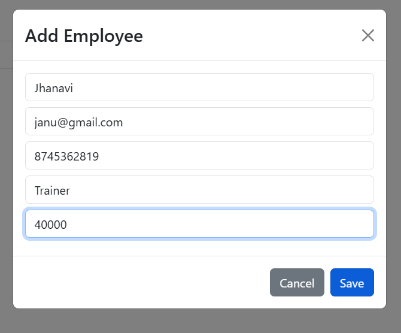
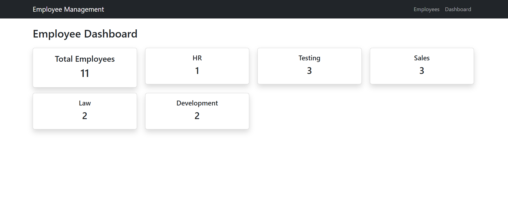
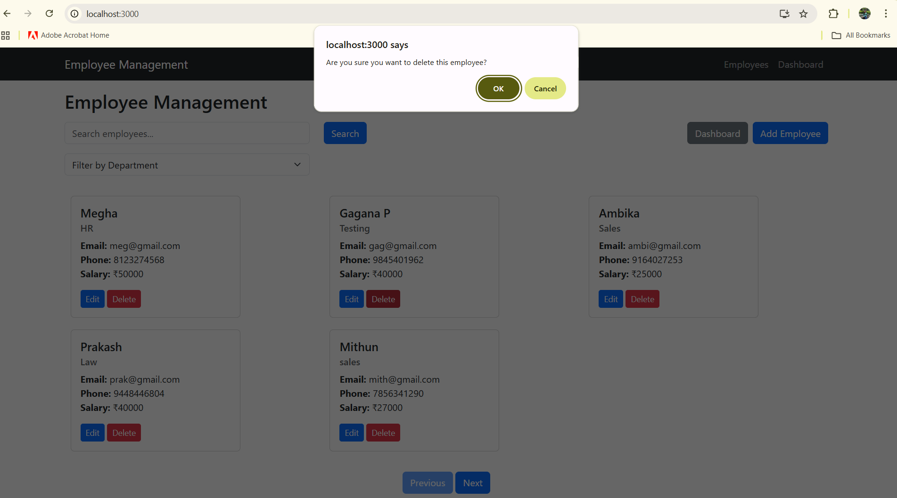
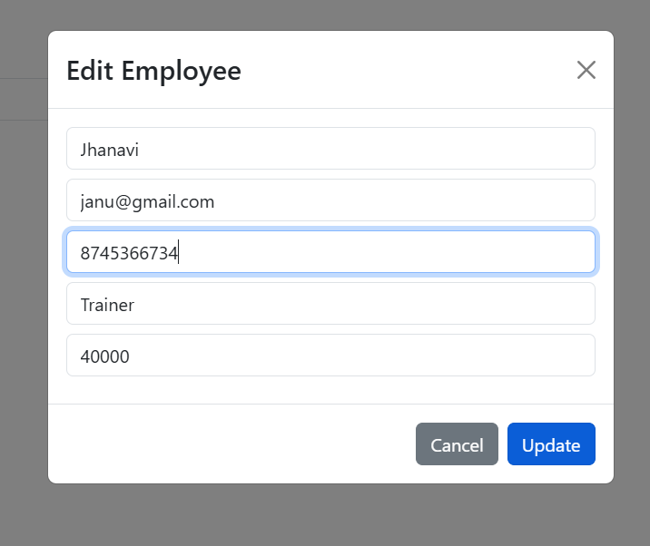
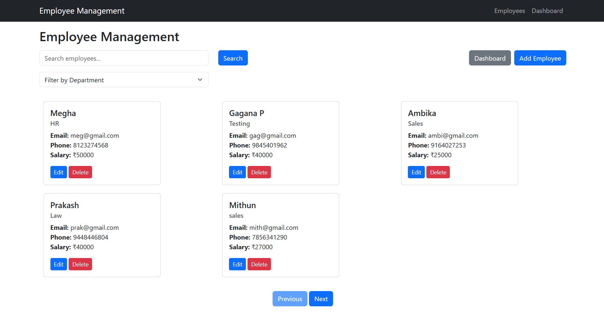
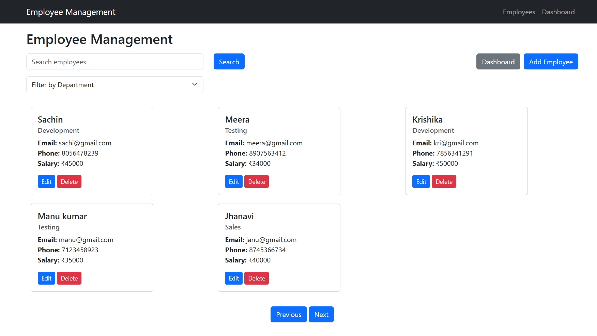
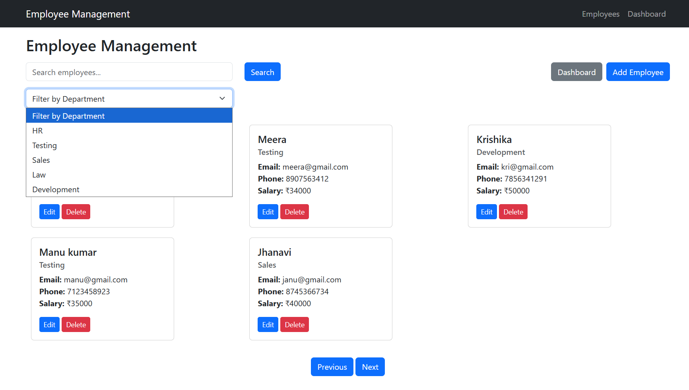
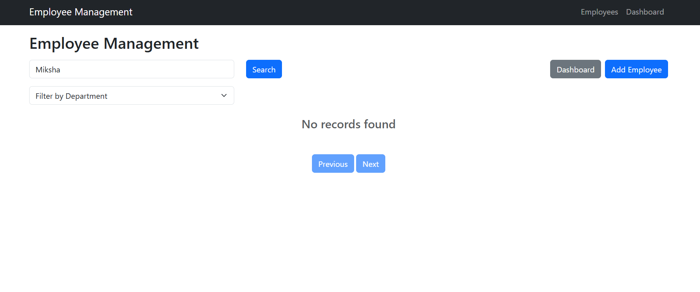
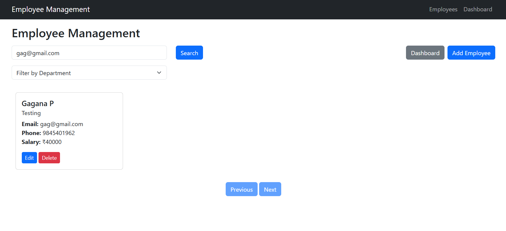
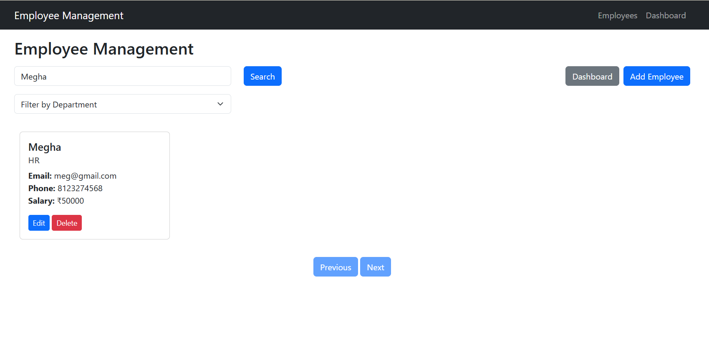

Employee Management System 

A complete Employee Management System built using:

- Spring Boot (Backend)
- React JS (Frontend)
- MySQL Database

This project supports:

- Add Employee
- Edit Employee
- Delete Employee
- List with Pagination
- Search Employee
- Filter by Department
- Dashboard with Department-Wise Counts

 Technologies Used
Frontend:-
React JS
Axios
Bootstrap
React Router

Backend :-
Spring Boot
Spring Data JPA
MySQL
Hibernate

How to Run the Backend (Spring Boot) - 
1️ Open MySQL and create database
CREATE DATABASE employee_db;

2️ Update database details in application.properties
spring.datasource.url=jdbc:mysql://localhost:3306/employee_db
spring.datasource.username=root
spring.datasource.password=YOUR_PASSWORD

3️ Run Backend
In IDE (STS/IntelliJ/Eclipse):
Right-click → Run EmployeeappApplication.java

Backend runs on:
http://localhost:8080

API Base URL:
http://localhost:8080/api/employees

How to Run the Frontend (React) -
1️ Install dependencies
npm install

2️ Start React App
npm start

Runs on:
http://localhost:3000

API Endpoints :
Method	          Endpoint	                         Description
GET	           /api/employees	                 Get paginated employees
GET	       /api/employees/search?keyword=abc	  Search employees
GET     	/api/employees/filter?department=HR	   Filter by department
GET  	     /api/employees/dashboard	            Dashboard counts
POST	        /api/employees	                     Add employee
PUT	          /api/employees/{id}	                 Update employee
DELETE	       /api/employees/{id}                   Delete employee

Screenshots:

 1. Add Employee
Shows the form where HR can add a new employee by entering name, email, phone number, department, and salary.  

 2. Dashboard
Displays employee statistics such as total employees and count by each department.  

 3. Delete Employee
Shows the confirmation popup before deleting an employee.  

 4. Edit Employee
Displays a pre-filled edit form allowing HR to update employee details.  

 5. Employee List (Page 1)
Shows paginated employee list with options to edit and delete.  

 6. Employee List (Page 2)
Shows the next set of employees using pagination.  

 7. Filter by Department
Displays employees based on selected department like HR, Testing, Sales, etc.  

 8. No Records Found
Displayed when search or filter returns no matching employees.  

 9. Search by Email
Shows search result when filtering by employee email.  

 10. Search by Name
Displays results when searching employees by their name.  

